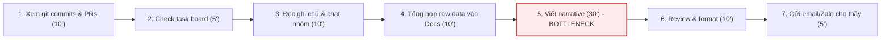
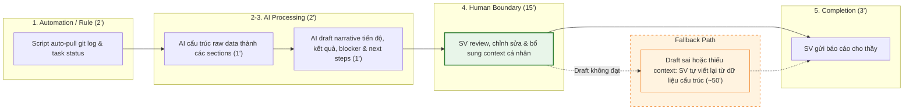
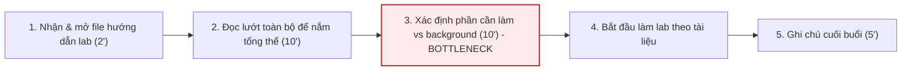
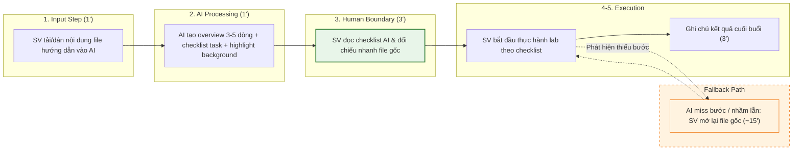
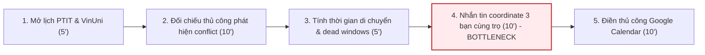
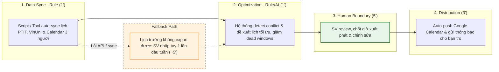

# 01 — Individual Problem Scan

> Điền theo Phase 1 + Phase 2 trong `01-worksheet.md`. Tự scan trước, dùng AI sau để phản biện. Không copy ví dụ Weekly Report.

## Thông tin cá nhân

- Họ và tên: Hoàng Ngọc Đăng Khoa 
- Mã học viên: 2A202602790
- Vai trò / bối cảnh: Sinh viên năm cuối học SWE tại PTIT đang trong giai đoạn làm đồ án và đang theo học khóa AI thực chiến tại VinUni
- Công việc hằng tuần (3-5 gạch đầu dòng để soi problem):
  + Báo cáo tiến độ đồ án cho thầy hướng dẫn
  + Kiểm tra lịch và lên kế hoạch cho tuần học tiếp theo tại VinUni
  + Buổi sáng làm lab(Những file hướng dẫn khá nhiều dẫn đến bị loãng thông tin), 
  buổi chiều học lý thuyết(Xem slide và nghe thầy/cô giảng bài), cuối buổi có minilab để tổng hợp lại kiến thức sau mỗi buổi học lý thuyết và tương tác với các bạn trong suốt cả ngày vào thời gian chính quy
  + Sinh hoạt và tự học tại trọ cùng 2 bạn cách VinUni 7km

---

## Phase 1 — Scan 5+ problems (tối thiểu 5, khuyến khích 8-10)

**Cách điền:** mỗi dòng = việc gì + ai chịu + đo bằng gì. Cột `Dấu hiệu thật` bắt buộc có số: mất bao lâu (bấm giờ mấy lần), mấy lần/tuần, bao nhiêu người gặp, log/ticket/quote nào.

| # | Lăng kính (Lặp lại / Tốn thời gian / AI có thể tốt hơn / Pain từ người khác) | Problem quan sát được | Ai chịu ảnh hưởng? | Dấu hiệu thật (số + bằng chứng) |
|---|---|---|---|---|
| 1 | Lặp lại | Mỗi tuần phải tổng hợp tiến độ đồ án (git commits, tasks hoàn thành, blockers) thành báo cáo narrative cho thầy hướng dẫn | Bản thân (SV làm đồ án), thầy hướng dẫn | Mất ~60-90 phút/tuần; SV năm cuối dành 25-35% effort đồ án (~2.5-4.5 giờ/tuần) cho documentation & reporting (ASEE — https://peer.asee.org/) |
| 2 | Tốn thời gian | Buổi sáng làm lab tại VinUni nhưng file hướng dẫn lab quá nhiều (nhiều file markdown/pdf, mỗi file nhiều section) — phải đọc lướt hết rồi mới biết bước nào cần làm, dẫn đến bị loãng thông tin và mất thời gian tìm đúng phần cần thiết | Bản thân, các bạn cùng lớp AI | Mất ~20-30 phút/buổi lab chỉ để scan và xác định phần cần tập trung trong hướng dẫn; 72% SV coi việc tổng hợp tài liệu dàn trải là bottleneck lớn nhất (Inside Higher Ed / Hanover Research 2024 — https://www.insidehighered.com/news/2024/02/14/survey-reveals-how-students-tackle-course-reading) |
| 3 | Tốn thời gian | Lên lịch tuần phải đối chiếu thời khóa biểu PTIT + lịch VinUni + thời gian di chuyển 7km, dễ bị conflict và "dead window" | Bản thân, 2 bạn cùng trọ (cùng di chuyển) | Mất ~30-40 phút/tuần lên lịch; SV commuter mất 5-8 giờ/tuần vào dead windows do timetable gaps (NCES — https://nces.ed.gov/pubsearch/pubsinfo.asp?pubid=2022144) |
| 4 | Lặp lại | Cuối buổi chiều có minilab để tổng hợp kiến thức lý thuyết vừa học — phải nhanh chóng xem lại slide, ghi chú, rồi áp dụng vào bài tập trong thời gian ngắn, thường không kịp | Bản thân, các bạn cùng lớp | Minilab ~30-45 phút nhưng mất thêm ~20-30 phút ở nhà để hoàn thiện vì không kịp tổng hợp tại lớp |
| 5 | Pain từ người khác | Bạn cùng nhóm đồ án hỏi lại context vì meeting notes không rõ hoặc thiếu action items sau buổi họp | 3-4 thành viên nhóm đồ án | Hỏi lại 2-3 lần/tuần trên Zalo/Discord; mỗi lần mất 10-15 phút giải thích lại |
| 6 | AI có thể tốt hơn | Tìm tài liệu/tutorial tham khảo liên quan cho đồ án — search Google/Stack Overflow/GitHub rồi phải đọc qua từng bài để đánh giá relevance và chất lượng | Bản thân | Mỗi lần tìm tài liệu mất 40-60 phút, khoảng 1-2 lần/tuần |
| 7 | Lặp lại | Mỗi sáng check traffic + thời tiết + coordinate với 2 bạn cùng trọ để quyết định giờ xuất phát đi VinUni | Bản thân, 2 bạn cùng trọ | 15-20 phút/ngày lên kế hoạch đi lại; SV commuter dành ~15-20 phút/ngày cho commute planning (NCES — https://nces.ed.gov/pubsearch/pubsinfo.asp?pubid=2022144) |
| 8 | Pain từ người khác | Thầy hướng dẫn feedback qua email/Zalo dài nhưng không structured — phải tự parse ra action items | Bản thân, thầy hướng dẫn | Mỗi tuần nhận 1-2 tin nhắn dài, mất ~20 phút parse thành tasks cụ thể |
| 9 | AI có thể tốt hơn | Buổi chiều học lý thuyết tại VinUni — thầy/cô giảng qua slide nhưng vừa nghe vừa ghi không kịp, slide đôi khi chỉ có keyword, về nhà phải bổ sung lại từ memory | Bản thân, các bạn cùng lớp | Mất thêm ~30 phút/buổi để bổ sung notes sau giờ học lý thuyết; 67% SV cảm thấy overwhelmed khi phải track thông tin trên nhiều nền tảng rời rạc (Inside Higher Ed / College Pulse — https://www.insidehighered.com/news/student-success/academic-life/2023/04/18/survey-how-college-students-manage-their-time) |
| 10 | Tốn thời gian | Review và debug code đồ án — đọc lại code cũ của mình hoặc teammate viết để hiểu logic trước khi sửa/thêm feature | Bản thân, teammates | Mất 30-45 phút mỗi lần review; 2-3 lần/tuần |

> Gợi ý tự soi: tuần trước mất nhiều thời gian nhất vào việc gì? Việc gì hay trì hoãn? Người khác hay hỏi lại câu gì? Workflow nào ai cũng biết là chậm?

**AI đã dùng ở Phase 1 (nếu có):**
- Prompt đã hỏi: "Với vai trò SV năm cuối SWE đang làm đồ án + học thêm khóa AI, liệt kê các pain points phổ biến trong workflow hàng tuần"
- Ý dùng được: AI gợi ý thêm pain về meeting notes thiếu action items (#5), parse feedback thầy (#8), và ghi chú bài giảng (#9) — đều khớp với trải nghiệm thật
- Ý bỏ vì không phải pain thật: AI gợi ý "quản lý tài chính cá nhân" và "networking với industry" — không phải workflow lặp lại hàng tuần, không có metric rõ

**Self-check Phase 1:**
- [x] Đủ 5+ dòng, mỗi dòng có actor + số đo cụ thể
- [x] Dùng ít nhất 3/4 lăng kính
- [x] Không có dòng chung chung kiểu "mất nhiều thời gian"

---

## Phase 2 — Top 3 Problem Cards

### 2.1. Chọn top 3

Giữ bài nào: actor cụ thể, workflow vẽ được 3-7 bước, bottleneck ở 1 bước, impact đo được. Loại bài quá rộng.

| Rank | Problem (copy từ bảng scan) | Vì sao chọn (2-3 ý) | Điều còn chưa chắc |
|---|---|---|---|
| 1 | Tổng hợp tiến độ đồ án thành báo cáo narrative cho thầy hướng dẫn | Workflow rõ ràng (git → tasks → viết report), lặp lại mỗi tuần, có metric thời gian cụ thể (60-90 phút), bottleneck nằm ở bước viết narrative | Thầy có chấp nhận report format mới không? Narrative "đủ tốt" đo thế nào? |
| 2 | File hướng dẫn lab quá nhiều gây loãng thông tin, mất thời gian scan tìm phần cần làm | Pain hàng ngày (mỗi buổi sáng lab), ảnh hưởng cả lớp, workflow rõ (nhận file → scan → tìm phần cần làm → bắt đầu), AI có thể tốt ở phần tóm tắt/cấu trúc | AI có hiểu đúng context kỹ thuật trong file hướng dẫn không? Nếu file có hình/code thì sao? |
| 3 | Lên lịch tuần đối chiếu PTIT + VinUni + di chuyển | Ảnh hưởng hàng ngày (3 người cùng trọ), có pain rõ (dead windows, conflict), dễ đo bằng thời gian tiết kiệm | Lịch 2 trường có API/export được không? Scope có quá rộng nếu tính cả traffic? |

### 2.2. Problem Cards chi tiết (lặp lại cho cả 3 cards)

---

#### Problem Card #1 — Báo cáo tiến độ đồ án

```text
Problem 1 câu:
Mỗi tuần SV năm cuối mất 60-90 phút tổng hợp tiến độ đồ án từ git commits, task board, và ghi chú cá nhân thành báo cáo narrative cho thầy hướng dẫn, trong đó bước viết narrative tốn nhất (~30 phút) và hay bị trì hoãn.

Actor:
Sinh viên năm cuối SWE (PTIT) đang làm đồ án tốt nghiệp, chịu trách nhiệm gửi báo cáo tiến độ hàng tuần cho thầy hướng dẫn.

Thời điểm / bối cảnh:
Cuối tuần hoặc tối Chủ Nhật, trước buổi gặp thầy hướng dẫn đầu tuần. Thường làm vội vì bận học ở VinUni cả tuần.

Current workflow 3-7 bước:
1. Mở GitHub xem lại commits và PRs trong tuần (~10 phút)
2. Check task board (Trello/Notion) xem tasks đã done/in-progress/blocked (~5 phút)
3. Đọc lại ghi chú cá nhân, chat nhóm trên Discord/Zalo để nhớ context (~10 phút)
4. Tổng hợp raw data vào Google Docs (~10 phút)
5. Viết narrative: tiến độ tổng quan, kết quả đạt được, blockers, kế hoạch tuần sau (~30 phút) <-- bottleneck
6. Self-review, chỉnh format, thêm screenshot/diagram nếu cần (~10 phút)
7. Gửi email/Zalo cho thầy (~5 phút)

Bottleneck:
Bước 5 — viết narrative từ raw data (commits, tasks) thành đoạn văn có insight cho thầy. Phải biến "merged PR #42: fix login API" thành "Hoàn thành module xác thực, giải quyết bug đăng nhập, sẵn sàng integrate với frontend". Mất ~30 phút và thường bị blank page.

Impact:
60-90 phút/tuần cho 1 SV. Nghiên cứu ASEE cho thấy SV năm cuối dành 25-35% effort đồ án (~2.5-4.5 giờ/tuần) cho documentation & reporting (ASEE — https://peer.asee.org/). Report trễ → thầy thiếu context trước buổi gặp → buổi gặp kém hiệu quả.

Success metric:
Giảm tổng thời gian từ 60-90 phút xuống dưới 25 phút; không tăng số câu thầy phải hỏi lại; report gửi đúng deadline (trước buổi gặp ít nhất 12 giờ).

Non-AI alternative:
Template report cố định + GitHub activity summary (tính năng có sẵn) + checklist items. Có thể giảm format effort nhưng chưa giải quyết phần viết narrative context-aware.

AI hypothesis:
AI đọc git log/task board summary, draft narrative (tiến độ, kết quả, blockers, next steps). SV review/edit trước khi gửi cho thầy. AI không tự bịa progress hay thêm thông tin ngoài data được cung cấp.

Quick gut:
[ ] No AI / process fix
[ ] Rule
[x] Workflow
[ ] Agent
[ ] Chưa biết
```

**Draft workflow Card #1** (ASCII / Mermaid / ảnh đính kèm):

```text
CURRENT STATE — 80 phút (trung bình)

[1 Xem git commits/PRs: 10']
→ [2 Check task board: 5']
→ [3 Đọc ghi chú + chat nhóm: 10']
→ [4 Tổng hợp vào Docs: 10']
→ [5 Viết narrative: 30']  <-- bottleneck
→ [6 Review + format: 10']
→ [7 Gửi thầy: 5']

FUTURE STATE — 22 phút

[1 Script auto-pull git log + task status: 2']  -- Rule/script
→ [2 AI cấu trúc dữ liệu thành sections: 1']  -- Workflow step
→ [3 AI draft narrative (tiến độ/blocker/next): 1']  -- Workflow step
→ [4 SV review + edit + thêm context cá nhân: 15']  -- human boundary
→ [5 SV gửi thầy: 3']

Fallback: AI draft sai hoặc thiếu context → SV bỏ draft, tự viết lại (quay về ~50 phút nhưng đã có data structured sẵn).
```

##### Sơ đồ Mermaid — Current State (Card #1)


##### Sơ đồ Mermaid — Future State (Card #1)


---
#### Problem Card #2 — File hướng dẫn lab gây loãng thông tin

```text
Problem 1 câu:
Mỗi buổi sáng lab tại VinUni, SV mất ~20-30 phút scan qua nhiều file hướng dẫn (markdown/pdf, nhiều section) để xác định phần nào cần tập trung làm, vì thông tin dàn trải và không có tóm tắt tổng quan, dẫn đến bắt đầu lab chậm và dễ bỏ sót bước quan trọng.

Actor:
Sinh viên khóa AI thực chiến tại VinUni, cần đọc và làm theo file hướng dẫn lab mỗi buổi sáng.

Thời điểm / bối cảnh:
Đầu buổi sáng tại VinUni. File hướng dẫn được phát trước hoặc đầu buổi, SV phải tự đọc và bắt đầu làm. Thời gian lab có hạn nên mỗi phút scan là mỗi phút mất đi cho thực hành.

Current workflow 3-7 bước:
1. Nhận/mở file hướng dẫn lab (thường 2-4 files, markdown/pdf) (~2 phút)
2. Đọc lướt toàn bộ để nắm big picture — file nào chứa gì, bao nhiêu phần (~10 phút)
3. Xác định phần nào là bước phải làm, phần nào là background/tham khảo (~10 phút) <-- bottleneck
4. Bắt đầu làm lab theo hướng dẫn, quay lại đọc khi không rõ (~phần còn lại buổi lab)
5. Ghi chú lại những gì đã làm/chưa làm để về nhà hoàn thiện (~5 phút)

Bottleneck:
Bước 2-3 — scan và phân loại nội dung trong file hướng dẫn. File nhiều section, mix giữa lý thuyết nền, hướng dẫn từng bước, code mẫu, và câu hỏi/bài tập. Không có overview hay checklist rõ ràng nên phải đọc hết mới biết cần làm gì. 72% SV coi việc tổng hợp tài liệu dàn trải là bottleneck lớn nhất (Inside Higher Ed / Hanover Research 2024 — https://www.insidehighered.com/news/2024/02/14/survey-reveals-how-students-tackle-course-reading).

Impact:
~20-30 phút/buổi lab × 3-4 buổi/tuần = 60-120 phút/tuần chỉ để scan file. Thời gian thực hành thực tế bị rút ngắn. Nếu scan sai → bỏ sót bước quan trọng → phải làm lại hoặc về nhà bổ sung.

Success metric:
Giảm thời gian scan từ ~25 phút xuống dưới 5 phút/buổi lab; không bỏ sót bước quan trọng nào (0 lần phải quay lại đọc vì miss bước).

Non-AI alternative:
Tự tạo checklist thủ công đầu mỗi buổi bằng cách lướt heading. Nhanh hơn đọc hết nhưng vẫn tốn 10-15 phút và dễ miss section nằm sâu trong file.

AI hypothesis:
AI đọc toàn bộ file hướng dẫn lab, tạo: (1) tóm tắt tổng quan 3-5 dòng, (2) checklist các bước cần làm theo thứ tự, (3) highlight phần nào là background có thể skip. SV đọc output AI rồi bắt đầu lab ngay, quay lại file gốc khi cần chi tiết.

Quick gut:
[ ] No AI / process fix
[ ] Rule
[x] Workflow
[ ] Agent
[ ] Chưa biết
```

**Draft workflow Card #2:**

```text
CURRENT STATE — ~25 phút scan + bắt đầu lab chậm

[1 Nhận/mở file hướng dẫn: 2']
→ [2 Đọc lướt toàn bộ file: 10']
→ [3 Xác định phần cần làm vs. background: 10']  <-- bottleneck
→ [4 Bắt đầu làm lab: ...]
→ [5 Ghi chú cuối buổi: 5']

FUTURE STATE — ~5 phút scan + bắt đầu lab nhanh

[1 Paste/upload file hướng dẫn vào AI: 1']  -- Rule/script
→ [2 AI tạo overview + checklist bước cần làm + highlight phần skip được: 1']  -- Workflow step
→ [3 SV đọc checklist AI, đối chiếu nhanh file gốc: 3']  -- human boundary
→ [4 Bắt đầu làm lab: ...]
→ [5 Ghi chú cuối buổi: 3']

Fallback: AI miss bước quan trọng hoặc nhầm background thành task → SV phát hiện khi làm lab, quay lại đọc file gốc (~15 phút, vẫn nhanh hơn scan toàn bộ).
```

##### Sơ đồ Mermaid — Current State (Card #2)


##### Sơ đồ Mermaid — Future State (Card #2)


---

#### Problem Card #3 — Lên lịch tuần PTIT + VinUni + di chuyển

```text
Problem 1 câu:
Mỗi tuần SV mất 30-40 phút đối chiếu thủ công thời khóa biểu PTIT, lịch VinUni, thời gian di chuyển 7km, và lịch bạn cùng trọ để lên kế hoạch tuần, nhưng vẫn thường xuyên gặp conflict hoặc dead windows 2-3 giờ giữa các buổi học.

Actor:
Sinh viên học song song 2 nơi (PTIT + VinUni), sống cùng 2 bạn cách VinUni 7km, cần coordinate di chuyển chung.

Thời điểm / bối cảnh:
Tối Chủ Nhật hoặc sáng thứ Hai, khi lịch tuần mới được publish. Phải tính cả yếu tố traffic, thời tiết.

Current workflow 3-7 bước:
1. Mở thời khóa biểu PTIT (web/app) và lịch VinUni (email/LMS) (~5 phút)
2. Đối chiếu thủ công xem slot nào conflict (~10 phút)
3. Tính thời gian di chuyển giữa 2 nơi, xác định dead windows (~5 phút)
4. Nhắn tin hỏi 2 bạn cùng trọ về lịch của họ để coordinate đi chung (~10 phút)  <-- bottleneck
5. Điền lịch vào Google Calendar, set reminders (~10 phút)

Bottleneck:
Bước 4 — coordinate với bạn cùng trọ. Phải chờ reply, so sánh lịch 3 người, negotiate giờ xuất phát. 42% SV commuter gặp schedule conflict là pain chính (Journal of College Student Retention — https://journals.sagepub.com/doi/10.1177/1521025119848751).

Impact:
30-40 phút/tuần planning + 5-8 giờ/tuần dead windows do gaps không optimize được (NCES — https://nces.ed.gov/pubsearch/pubsinfo.asp?pubid=2022144). Nếu conflict không phát hiện sớm → miss lớp hoặc miss buổi gặp thầy.

Success metric:
Giảm thời gian lên lịch từ 30-40 phút xuống dưới 10 phút; giảm số dead windows từ ~5 giờ/tuần xuống dưới 2 giờ/tuần.

Non-AI alternative:
Dùng shared Google Calendar cho 3 người + set rule cố định (ví dụ: luôn đi chung vào sáng T2, T4, T6). Đơn giản, hiệu quả nếu lịch ít thay đổi, nhưng không xử lý tốt tuần có lịch bất thường.

AI hypothesis:
AI đọc lịch 2 trường + calendar 3 người → suggest lịch tuần tối ưu (minimize dead windows, gom buổi học gần nhau). SV approve/chỉnh trước khi apply.

Quick gut:
[ ] No AI / process fix
[x] Rule
[ ] Workflow
[ ] Agent
[ ] Chưa biết
```

**Draft workflow Card #3:**

```text
CURRENT STATE — 40 phút + nhiều dead windows

[1 Mở lịch 2 trường: 5']
→ [2 Đối chiếu conflict: 10']
→ [3 Tính di chuyển + dead windows: 5']
→ [4 Coordinate bạn cùng trọ: 10']  <-- bottleneck
→ [5 Điền Google Calendar: 10']

FUTURE STATE — 10 phút

[1 Auto-sync lịch PTIT + VinUni + Calendar 3 người: 1']  -- Rule/script
→ [2 AI detect conflicts + suggest optimal schedule: 1']  -- Rule step
→ [3 SV review + approve lịch + adjust: 5']  -- human boundary
→ [4 Auto-push vào Google Calendar + notify bạn trọ: 3']

Fallback: Lịch trường không export được → SV nhập thủ công 1 lần đầu tuần, AI chỉ optimize phần coordinate.
```

##### Sơ đồ Mermaid — Current State (Card #3)


##### Sơ đồ Mermaid — Future State (Card #3)


---

### 2.3. Card muốn pitch nhất (chuẩn bị 2 phút)

**Card tôi muốn pitch nhất:**

```text
Card #1 — Báo cáo tiến độ đồ án
```

**Vì sao (2-3 câu: workflow gì, số đo gì, impact gì):**

```text
Workflow rõ ràng nhất trong 3 cards: git commits + task board → tổng hợp → viết narrative → gửi thầy. Có baseline đo được (60-90 phút/tuần), bottleneck tập trung ở 1 bước (viết narrative ~30 phút), và impact trực tiếp (report trễ = buổi gặp thầy kém hiệu quả). Đây cũng là bài toán gần nhất với case "Weekly Report" trong industry — nghiên cứu ASEE cho thấy 25-35% effort đồ án nằm ở documentation, tức đây là pain phổ biến chứ không chỉ riêng tôi.
```

**Câu hỏi tôi muốn nhóm challenge (1-2 câu hỏi đúng chỗ yếu):**

```text
1. Metric "không tăng số câu thầy hỏi lại" có đủ để đo quality không? Hay cần thêm metric về depth/insight của report?
2. Nếu thầy hướng dẫn có style feedback rất khác nhau giữa các giảng viên, liệu một workflow chung có áp dụng được không?
```

**AI phản biện Card (nếu có):**
- Điểm yếu AI chỉ ra: Metric "số câu thầy hỏi lại" phụ thuộc vào style thầy (có thầy hay hỏi sâu dù report tốt). Nên thêm metric phụ như "% nội dung draft AI mà SV giữ nguyên sau review" để đo quality trực tiếp hơn.
- Tôi sửa gì: Thêm metric phụ "SV giữ lại ≥60% draft AI sau review" vào success metric. Nếu dưới 60% trong 2 tuần liên tiếp → AI draft chưa đủ tốt, cần cải thiện prompt hoặc hạ về template + checklist.

### Self-check nộp phần 01
- [x] Có 5+ problems + top 3 Cards đủ field
- [x] Mỗi Card có workflow trước/sau + bottleneck + metric + fallback
- [x] Đã chọn 1 card pitch + câu hỏi challenge
