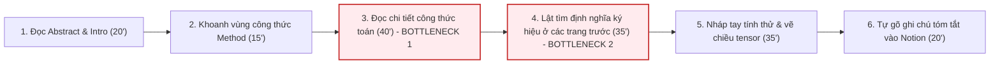

```mermaid
flowchart LR
    subgraph S1["1. Rule Trích Xuất (2')"]
        M1["OCR / LaTeX Parser + Quét toàn văn tìm vị trí xuất hiện ký hiệu (Rule)"]
    end

    subgraph S2["2. Build Knowledge Graph (3')"]
        M2["Dựng Đồ Thị Tri Thức:
• Nodes: Symbol, Equation, Section, DefinitionSpan
• Edges: DEFINED_IN, USED_IN, SAME_AS"]
    end

    subgraph S3["3. Human Trigger (1')"]
        H1["Sinh viên bôi chọn công thức toán cần đọc"]
    end

    subgraph S4["4. GraphRAG Retrieval (2')"]
        G1["GraphRAG: Multi-hop Traversal lấy toàn bộ định nghĩa liên quan
+ Vector RAG truy xuất ngữ cảnh mô tả xung quanh"]
    end

    subgraph S5["5. LLM Synthesis (2')"]
        A1["LLM phân rã biến & tensor shapes + xuất mã giả PyTorch"]
    end

    subgraph S6["6. Human Boundary (15')"]
        H2["Sinh viên đối chiếu trích đoạn gốc + số trang & kiểm tra tensor"]
    end

    subgraph S7["7. Export (10')"]
        E1["Tự động kết xuất Markdown có cấu trúc"]
    end

    M1 --> M2
    M2 --> H1
    H1 --> G1
    G1 --> A1
    A1 --> H2
    H2 --> E1
    H2 -.->|"Nếu nghi vấn / thiếu cạnh"| FB["Fallback: Nhấp vào Symbol để nhảy thẳng đến trang gốc tác giả"]

    style H2 fill:#e8f5e9,stroke:#2e7d32,stroke-width:2px
    style FB fill:#fff9c4,stroke:#fbc02d,stroke-width:1px
```

# 02 — Group Problem Statement (Bản nộp nhóm)

> Làm chung 1 bản, mỗi thành viên copy vào repo cá nhân. Đi theo Phase 3 → 6 trong `01-worksheet.md`. Nhóm chỉ chọn **candidate problem** ở Phase 3, viết Problem Statement sau khi validate + vẽ workflow.

## Thành viên nhóm

| STT | Họ và tên | Mã học viên | Vai trò trong nhóm (VD: facilitator, workflow, research, writer) |
|-----|-----------|-------------|---------------------------------------------------------------|
| 1   | Nguyễn Thái Anh | 2A202602810 | **Research Lead** (Khảo sát công cụ thị trường, thiết kế validation, thẩm định tính đúng đắn toán học) |
| 2   | Đoàn Quang Minh | 2A202602711 | **Problem Owner / Facilitator** (Cung cấp bài toán gốc từ đồ án tốt nghiệp, điều phối thảo luận nhóm) |
| 3   | Ngọ Doãn Ngọc | 2A202602635 | **Workflow Lead** (Bối cảnh: Giáo viên; mô hình hóa Current/Future workflow, xác định điểm nghẽn và Human boundary) |
| 4   | Hoàng Ngọc Đăng Khoa | 2A202602790 | **Writer / Documentation** (Bối cảnh: SV năm cuối SWE PTIT & học viên VinUni; chuẩn hóa Problem Statement v0/v1, biên tập rubric) |

**Candidate problem nhóm chọn (1 câu):**

Sinh viên năm cuối ngành CNTT (chuyên ngành AI) mất trung bình 2–3 tiếng trong tổng số 8–10 tiếng nghiên cứu mỗi bài báo kỹ thuật để giải mã các công thức toán và thuật toán phức tạp (ký hiệu ma trận, hàm mất mát tùy biến, đạo hàm tensor), trong đó việc thiếu ngữ cảnh trực quan và phải lật tìm định nghĩa ký hiệu tản mát xuyên suốt bài báo là điểm nghẽn lớn nhất làm chậm tiến độ nghiên cứu đồ án.

---

## Phase 3 — Group Convergence: từ 9-12 candidates về 1

### 3.1. Trình bày top 3 mỗi người (mỗi candidate 1-2 phút)

| # | Người đưa ra | Candidate problem | Người gặp vấn đề | Điểm nghẽn | Cảm nhận nhanh của nhóm |
|---|---|---|---|---|---|
| 1 | Thái Anh | Mất phương hướng khi mở code template lab sáng (không rõ input/output và data contract) | Học viên làm lab (bootcamp K4A) | Mất 20' trace code mẫu đoán format dữ liệu (list, dict, tensor) | Rất thực tế trong 6 tuần học, phạm vi gọn gàng |
| 2 | Thái Anh | Đọc hiểu slide lý thuyết 40+ trang bị văn phong AI dịch thuật gượng gạo và lệch ngữ cảnh | Sinh viên học lý thuyết | Mất 55' nhảy qua lại giữa slide và tài liệu gốc | Pain lớn về nhận thức, nhưng khó chuẩn hóa format slide đầu vào |
| 3 | Thái Anh | Thao tác ghép file báo cáo nhóm và đồng bộ bài nộp về repo cá nhân cuối giờ lab | 4 thành viên trong nhóm | Mất 20-30' sửa lỗi bảng Markdown và copy thủ công | Bài toán thuần Rule/Automation, không cần đến AI |
| 4 | Quang Minh | Đọc paper kỹ thuật dài: Tốn 2-3h giải mã công thức toán/thuật toán cho đồ án tốt nghiệp | Sinh viên làm đồ án AI | Mất 2-3h lật tìm định nghĩa ký hiệu và suy luận chiều không gian ma trận | Pain cực lớn, đo được bằng số giờ cụ thể, ai làm AI cũng gặp |
| 5 | Quang Minh | Tra nghĩa lời bài hát đa quốc gia khi nghe nhạc giải trí hàng ngày | Người nghe nhạc cá nhân | Tra cứu từ ngữ rời rạc mất 15'/bài | Nhu cầu giải trí cá nhân, impact thấp, không liên quan chuyên môn |
| 6 | Quang Minh | Sinh hoạt không điều độ do không cố định lịch làm việc đồ án ở nhà | Sinh viên tự học ở nhà | Thức khuya đến 3h sáng, ngày làm việc thất thường | Vấn đề kỷ luật bản thân, không phải quy trình xử lý thông tin |
| 7 | Doãn Ngọc | Chấm bài tự luận và viết feedback cá nhân cho từng học sinh theo rubric | Giáo viên (tiếng Anh / tiểu học / THCS) | Mất ~150'/30 bài (5'/bài); bottleneck ở khâu đọc bài, phân tích lỗi và viết nhận xét | Workflow sư phạm rất rõ ràng, đo được bằng phút, AI có khả năng NLP tốt |
| 8 | Doãn Ngọc | Soạn bài tập phân hóa theo nhiều trình độ học sinh khác nhau | Giáo viên | Phải soạn nhiều phiên bản bài tập, tốn nhiều thời gian tổng hợp thủ công | Lặp lại thường xuyên, dễ tạo prototype |
| 9 | Doãn Ngọc | Hỗ trợ học sinh tự phát hiện và sửa lỗi phát âm/ngữ pháp tiếng Anh | Học sinh, Giáo viên | Nhiều học sinh cùng gặp vấn đề khiến giáo viên không thể hỗ trợ cùng lúc | Nhu cầu thực tế cao, AI hỗ trợ ngôn ngữ rất phù hợp |
| 10 | Đăng Khoa | Tổng hợp tiến độ đồ án (git commits, tasks, blockers) thành báo cáo narrative cho GVHD | SV làm đồ án tốt nghiệp, GVHD | Mất 60-90'/tuần; SV năm cuối dành 25-35% effort đồ án cho reporting (ASEE); bottleneck viết narrative ~30' | Workflow chuẩn chỉ, lặp lại hàng tuần, có nghiên cứu chứng minh impact |
| 11 | Đăng Khoa | File hướng dẫn lab tại VinUni quá nhiều section/file gây loãng thông tin, mất thời gian tìm phần cần làm | Học viên học AI tại VinUni | Mất 20-30'/buổi lab chỉ để scan tài liệu; 72% SV coi tài liệu dàn trải là bottleneck (Inside Higher Ed 2024) | Đụng chạm hàng ngày tại lớp, ảnh hưởng nhiều bạn |
| 12 | Đăng Khoa | Lên lịch tuần đối chiếu TKB PTIT + lịch học VinUni + thời gian di chuyển 7km của 3 bạn commuter | Bản thân, 2 bạn cùng trọ | Mất 30-40'/tuần; SV commuter mất 5-8h/tuần vào dead windows do timetable gaps (NCES) | Rất thực tế với sinh viên ngoại trú, nhưng mang tính cá nhân |

### 3.2. Gom trùng / cluster (gom 9-12 ý thành 3-4 cụm)

| Cluster | Candidates included | Pattern chung | Ghi chú |
|---|---|---|---|
| **A: Đọc hiểu & Giải mã tài liệu học thuật / Chuyên môn** | #2, #4, #11 | Xử lý khối lượng tài liệu học thuật lớn (slide, paper, hướng dẫn lab), gặp rào cản về thuật ngữ, ký hiệu toán học ma trận và thông tin dàn trải gây loãng ngữ cảnh. | Cụm có giá trị trí tuệ cao nhất, gắn liền với năng lực nghiên cứu của cả sinh viên AI và người học chuyên sâu. |
| **B: Lập trình, Đồ án & Quy trình Báo cáo GVHD** | #1, #3, #10 | Thao tác kỹ thuật xoay quanh đồ án tốt nghiệp và lab: Quản lý data contract, sync repo nhóm, chuyển đổi git commits/tasks thành narrative report. | Đều xoay quanh áp lực đồ án tốt nghiệp năm cuối, có workflow nghiệp vụ từ raw data sang output chuẩn hóa. |
| **C: Giảng dạy, Đánh giá & Phản hồi Học tập** | #7, #8, #9 | Tác vụ sư phạm lặp lại của giáo viên: Chấm bài tự luận theo rubric, phân hóa bài tập theo trình độ, sửa phát âm/ngữ pháp cho học sinh. | Workflow giáo dục cực kỳ chuẩn mực, nhưng mang tính đặc thù chuyên môn ngành sư phạm. |
| **D: Sinh hoạt, Di chuyển & Thói quen Cá nhân** | #5, #6, #12 | Quản lý thời gian cá nhân, nhịp sinh hoạt, tra cứu giải trí, lên lịch commute 7km tránh dead windows. | Vấn đề lối sống và kỷ luật bản thân, không phải quy trình xử lý thông tin nghiệp vụ cốt lõi, loại bỏ. |

### 3.3. Shortlist (giữ 2-3 bài trả lời được 7 câu hỏi worksheet)

| Candidate | Vì sao vào shortlist (2-3 ý) | Rủi ro / điều chưa rõ |
|---|---|---|
| **Candidate #4 (Quang Minh): Giải mã công thức toán trong paper kỹ thuật dài** | - Actor rõ nét (sinh viên làm đồ án/nghiên cứu AI).<br>- Điểm nghẽn định lượng cực lớn (2–3 tiếng/paper cho phần toán).<br>- Cả 4 thành viên (đặc biệt 3 SV AI/SWE) đều đang gặp trực tiếp hàng tuần. | AI có nguy cơ hallucinate giải thích sai bản chất thuật toán hoặc gán nhầm ý nghĩa các biến ký hiệu. |
| **Candidate #10 (Đăng Khoa): Tổng hợp báo cáo narrative tiến độ đồ án cho GVHD** | - Workflow rõ ràng (git → tasks → viết report), lặp lại mỗi tuần.<br>- Có metric thời gian cụ thể (60–90 phút), số liệu nghiên cứu ASEE xác thực.<br>- Cả Khoa, Minh, Thái Anh đều có GVHD đồ án tốt nghiệp. | GVHD có chấp nhận format mới không; một template báo cáo cố định (Non-AI) có thể đã giải quyết được 70%. |
| **Candidate #7 (Doãn Ngọc): Chấm bài tự luận và viết feedback theo rubric cho học sinh** | - Workflow sư phạm 6 bước rất rõ ràng, đo được bằng phút (150'/30 bài).<br>- Điểm nghẽn ở khâu đọc và viết nhận xét cá nhân hóa.<br>- AI có thế mạnh vượt trội về NLP và đối chiếu rubric. | Thuộc domain giáo dục/sư phạm (chỉ Doãn Ngọc là giáo viên), 3 thành viên còn lại khó kiểm chứng nghiệp vụ sâu. |

### 3.4. Score để đồng thuận (chấm 1-5, ép nói rõ vì sao cho 5 / cho 3)

| Candidate | Actor rõ | Workflow rõ | Pain có evidence | Impact đo được | Làm trong lab | So sánh R/W/A được | Nhóm hiểu domain | Tổng |
|---|---:|---:|---:|---:|---:|---:|---:|---:|
| **Candidate #4 (Paper Math - Minh)** | 5 | 5 | 5 | 5 | 4 | 5 | 5 | **34** |
| **Candidate #10 (Báo cáo narrative đồ án - Khoa)** | 5 | 5 | 5 | 4 | 4 | 4 | 5 | **32** |
| **Candidate #7 (Chấm bài tự luận - Ngọc)** | 5 | 4 | 4 | 4 | 3 | 4 | 3 | **27** |

**Candidate nhóm chọn (1 bài duy nhất):**

```text
Candidate #4: Giải mã công thức toán học và thuật toán phức tạp trong paper kỹ thuật dài phục vụ nghiên cứu & đồ án tốt nghiệp AI.
```

**Vì sao chọn (4-5 câu):**

```text
Nhóm gồm 3 sinh viên năm cuối CNTT/SWE (Thái Anh, Quang Minh, Đăng Khoa) đều đang trong giai đoạn làm đồ án tốt nghiệp và bạn Doãn Ngọc đang theo học chương trình AI thực chiến tại VinUni. Việc đọc hiểu paper học thuật quốc tế (NeurIPS, CVPR, ICLR) là nhiệm vụ bắt buộc hàng tuần của tất cả các thành viên để áp dụng vào pipeline mô hình AI. Đây là bài toán có thời gian lãng phí lớn nhất (chiếm 2–3 tiếng trong tổng 10 tiếng nghiên cứu mỗi bài báo), gây tắc nghẽn toàn bộ tiến trình code thực nghiệm phía sau. Bài toán có cấu trúc văn bản học thuật chặt chẽ (Methodology, Equations, Symbol definitions), cho phép phân định rành mạch giữa bước máy trích xuất ký hiệu và bước người kiểm chứng tính đúng đắn toán học. Quan trọng nhất, giải quyết bài toán này đem lại giá trị kỹ thuật dài hạn cho cả nhóm khi làm việc tại các lab nghiên cứu hoặc môi trường công nghệ cao như Vin.
```

**Vì sao KHÔNG chọn các candidate còn lại (mỗi bài 2-3 câu):**

```text
- Không chọn Candidate #10 của Đăng Khoa (Báo cáo narrative đồ án): Mặc dù đây là pain point rất thực tế của sinh viên tốt nghiệp (60-90'/tuần), nhưng việc sử dụng template báo cáo cố định kết hợp công cụ GitHub release summary có sẵn (giải pháp phi AI) đã có thể giải quyết được 70-80% vấn đề; trong khi đó, công thức toán trong paper là rào cản nhận thức thực sự không thể giải quyết bằng template tĩnh.
- Không chọn Candidate #7 của Doãn Ngọc (Chấm bài tự luận & feedback): Bài toán chấm bài có workflow rất chuẩn chỉ và đo được thời gian rõ ràng, nhưng thuộc về domain sư phạm giáo dục phổ thông (chỉ có Doãn Ngọc đang trực tiếp giảng dạy), trong khi 3 thành viên còn lại đều học chuyên ngành AI/SWE kỹ thuật, do đó nhóm chọn bài toán Paper để cả 4 thành viên đều hiểu sâu domain và đóng góp được tối đa chuyên môn.
```

**Disagreement (nếu có — ai lo gì, chốt ra sao):**

```text
Trong buổi thảo luận, nhóm đã có sự phân vân giữa bài toán Báo cáo đồ án của Đăng Khoa, bài toán Giáo dục của Doãn Ngọc và bài toán Đọc paper của Quang Minh. Doãn Ngọc chia sẻ rằng dù làm giáo viên, bản thân hiện cũng đang theo học AI tại VinUni và nhận thấy việc giải mã paper/slide kỹ thuật là rào cản nhận thức lớn nhất mỗi buổi chiều, vì vậy Ngọc hoàn toàn ủng hộ hội tụ về Candidate #4 để phục vụ việc học AI chung của cả nhóm. Về mặt kỹ thuật, Thái Anh (Research Lead) đặt nghi vấn: 'Nếu AI giải thích sai một ký hiệu ma trận thì ai chịu trách nhiệm?'. Nhóm đã chốt giải pháp: Thiết lập Human Boundary nghiêm ngặt, bắt buộc người đọc phải đối chiếu tính tương thích số chiều Tensor và kiểm tra trích đoạn gốc trước khi áp dụng vào code.
```

---

## Phase 4 — Quick Validation + Research

### 4.1. Quick validation (ít nhất 1 cách: interview 2-3 người hoặc survey 5-10 người)

| Nguồn | Số người / mẫu | Tín hiệu xác nhận (kèm quote nguyên văn) | Tín hiệu phản bác | Nhóm sửa problem thế nào |
|---|---:|---|---|---|
| **Interview** | 3 sinh viên năm cuối CNTT AI (PTIT, VinUni, HUST) | - *"Đọc abstract và intro thì 15' là hiểu, nhưng cứ đụng vào phần Math với các công thức gộp 3-4 hàm Loss là kẹt cả buổi chiều."*<br>- *"Khổ nhất là tác giả dùng 1 ký hiệu ở trang 3 nhưng mãi trang 7 mới nhắc lại, phải lật ngược lật xuôi tìm xem biến đó là scalar hay matrix."* | *"Một số paper lý thuyết thuần (Statistical Learning) toán quá sâu, AI hiện nay giải thích chỉ toàn dịch chữ chứ không nắm được bản chất tiên đề."* | Thu hẹp phạm vi: Tập trung vào paper ứng dụng thực nghiệm (Deep Learning / Computer Vision / NLP), không nhận paper toán thuần túy lý thuyết. |
| **Survey / poll** | 12 sinh viên đang làm đồ án AI | 10/12 (83.3%) bạn khẳng định khâu đọc hiểu công thức và thuật toán trong Methodology là bước tốn nhiều thời gian nhất, trung bình mất **2.3 giờ/paper** chỉ cho các khối phương trình. | 2/12 bạn cho rằng khâu chạy code thực nghiệm (setup GPU, tái lập benchmark) mới là khâu lâu nhất. | Nhóm xác định rõ: Khâu chạy code lâu là do hiểu sai logic toán từ trước; giải quyết khâu hiểu toán là điều kiện tiên quyết giúp rút ngắn thời gian debug code sau này. |
| **Log ghi chép cá nhân** | 1 tuần đọc 2 paper của bạn Minh | Paper 1 (Diffusion model): mất 2h45' cho phần công thức chuyển đổi nhiễu; Paper 2 (Transformer variant): mất 2h10' cho phần Attention scaling. | Không có tín hiệu phản bác, số liệu bấm giờ thực tế hoàn toàn trùng khớp với giả định. | Giữ nguyên con số baseline là 2–3 tiếng cho khâu giải mã công thức toán. |

**Insight sau validation (1-2 câu — pain thật nằm ở đâu):**

```text
Pain thật sự không nằm ở việc dịch tiếng Anh sang tiếng Việt, mà nằm ở việc mất dấu định nghĩa ký hiệu (Symbol Disconnection) xuyên suốt bài báo và thiếu trực quan hóa về chiều không gian biến đổi của các tensor trong các phương trình toán học phức tạp.
```

### 4.2. Research giải pháp đã có (ít nhất 2-3 tools/patterns + 1-2 link kiểm được)

| Nguồn / tool / case | Link | Họ giải quyết bước nào? | Điểm mạnh | Khoảng trống / rủi ro | Bài học cho nhóm |
|---|---|---|---|---|---|
| **SciSpace (Typeset.io)** | [scispace.com](https://scispace.com) | Cho phép bôi đen khối công thức toán trên file PDF và hỏi Copilot *"Explain this math formula"*. | Trích xuất OCR công thức nhanh, giao diện đọc PDF trực quan, có giải thích sơ bộ từng ký hiệu. | Giải thích mang tính ngữ cảnh cục bộ; thường xuyên bịa nghĩa nếu ký hiệu toán học đó phụ thuộc vào định nghĩa ở Section trước; không phân tích được chiều tensor. | Bắt buộc phải có bước phân tích toàn văn bài báo để lập bảng tra cứu ký hiệu toàn cục (Global Symbol Table) trước khi giải thích công thức cục bộ. |
| **Mathpix Snip** | [mathpix.com](https://mathpix.com) | Chụp ảnh màn hình / bôi chọn công thức toán trong PDF và chuyển đổi sang mã LaTeX / MathML chuẩn. | Độ chính xác OCR toán học đạt >98%, nhận diện hoàn hảo các chỉ số trên/dưới, ma trận lồng nhau. | Thuần túy là công cụ Rule/OCR trích xuất cú pháp; hoàn toàn không có khả năng phân tích ngữ nghĩa hay giải thích thuật toán. | Sử dụng tầng OCR/Rule của Mathpix hoặc parser LaTeX tương đương để làm sạch đầu vào cho AI, tránh việc AI đọc nhầm ký hiệu toán học. |
| **Papers with Code** | [paperswithcode.com](https://paperswithcode.com) | Liên kết bài báo arXiv với repository GitHub chính thức và các bản tái lập mã nguồn cộng đồng. | Cung cấp mã nguồn thực tế để đối chiếu xem công thức toán được implement thành các dòng code PyTorch nào. | Người đọc vẫn phải tự mò mẫm hàng nghìn dòng code để tìm xem đoạn code nào tương ứng với phương trình nào trong paper; không có giải thích lý thuyết. | Cần tạo cầu nối trực quan: Công thức toán → Kích thước Tensor (Tensor Shapes) → Mã giả (Pseudocode) tương đương trong PyTorch. |

**Research takeaway (2-3 câu — nên build gì / không build gì):**

```text
Nhóm KHÔNG NÊN xây dựng một chatbot tổng quát tự động đọc toàn bộ bài báo vì chi phí context token cao và sinh ra nhiều câu trả lời lan man. Nhóm NÊN xây dựng một Workflow tích hợp GraphRAG & Rule: (1) Dùng Rule OCR/LaTeX bóc tách văn bản và lập đồ thị tri thức (Knowledge Graph) liên kết giữa Symbol, Equation, Section và DefinitionSpan; (2) Khi người dùng chọn công thức, GraphRAG thực hiện multi-hop traversal kết hợp Vector RAG để gom trọn vẹn mọi định nghĩa liên quan xuyên suốt bài báo; (3) LLM phân rã biến số và tensor shape với đầy đủ context chuẩn; (4) Con người giữ vai trò Human Boundary đối chiếu trích đoạn gốc.
```

---

## Phase 5 — Workflow + Problem Statement

### 5.1. Current workflow bản nhóm

```text
CURRENT STATE — 165 phút (~2.75 giờ) cho khâu đọc hiểu lý thuyết & toán học của 1 paper

[1 Đọc Abstract & Intro: 20'] 
  → [2 Đọc lướt Methodology & đánh dấu phương trình: 15'] 
  → [3 Đọc chi tiết công thức toán: 40']  <-- bottleneck 1: bế tắc trước ký hiệu lạ
  → [4 Lật tìm định nghĩa ký hiệu ở các trang trước: 35']  <-- bottleneck 2: mất dấu biến số
  → [5 Nháp tay & vẽ chiều ma trận để hiểu luồng: 35'] 
  → [6 Tự tóm tắt ghi chú vào Notion: 20']
```



| Bước | Actor | Input | Output | Thời gian / tần suất | Ghi chú (handoff? bottleneck?) |
|---|---|---|---|---|---|
| 1 | Sinh viên nghiên cứu | File PDF bài báo khoa học (10–15 trang) | Hiểu được bài toán tổng thể và kết quả chính | 20' / 1 paper/tuần | Đọc nhanh, ít khi bị tắc nghẽn |
| 2 | Sinh viên nghiên cứu | Section Methodology của paper | Danh sách các phương trình toán cốt lõi | 15' / 1 paper/tuần | Xác định trọng tâm cần đọc |
| 3 | Sinh viên nghiên cứu | Các khối phương trình toán phức tạp | Sự mơ hồ về mặt ký hiệu và phép toán | 40' / 1 paper/tuần | **Bottleneck 1:** Bế tắc trước các ký hiệu ước lệ mới hoặc phép toán ma trận phức tạp |
| 4 | Sinh viên nghiên cứu | Toàn văn các section trước đó của bài báo | Tìm thấy đoạn văn định nghĩa ký hiệu | 35' / 1 paper/tuần | **Bottleneck 2:** Lật qua lật lại giữa các trang PDF để tìm định nghĩa biến số, rất dễ mất tập trung |
| 5 | Sinh viên nghiên cứu | Giấy nháp, bút, tài liệu phụ | Sơ đồ biến đổi chiều không gian tensor | 35' / 1 paper/tuần | Tính toán thủ công để hiểu xem ma trận nhân với vector ra shape gì |
| 6 | Sinh viên nghiên cứu | Sự hiểu biết sau khi nháp | Bản ghi chép trên Notion / Obsidian | 20' / 1 paper/tuần | Gõ lại tốn công, dễ chán nản |

**Bottleneck chính (2-3 câu):**

```text
Điểm nghẽn nghiêm trọng nhất là bước 3 và bước 4 (ngốn 75 phút): Người đọc bị ngắt quãng dòng tư duy liên tục vì phải lật ngược lại các trang trước để truy tìm định nghĩa ký hiệu (Symbol Hunting). Việc thiếu một cơ chế hiển thị định nghĩa tức thời khiến sinh viên phải tốn thêm nhiều thời gian nháp tay kiểm tra lại từng chiều không gian của các ma trận trong công thức.
```

---

### 5.2. Future workflow bản nhóm

Phải nhìn ra 5 thứ: bước nào máy (Rule), bước nào AI, bước nào người, boundary ở đâu, fallback khi AI sai.

```text
FUTURE STATE — 35 phút (tiết kiệm 130 phút, giảm 78% thời gian)

[1 Rule trích xuất: OCR/LaTeX + quét toàn văn tìm mọi lần xuất hiện ký hiệu: 2' - Máy (Rule)]
  → [2 Build Knowledge Graph: dựng node Symbol/Equation/Section/DefinitionSpan + cạnh DEFINED_IN/USED_IN/SAME_AS: 3' - Máy (Graph Engine)]
  → [3 Người chọn công thức cần đọc: 1' - Human Trigger]
  → [4 GraphRAG retrieval: traverse đồ thị lấy toàn bộ định nghĩa + công thức liên quan (multi-hop) + Vector RAG mô tả ngữ nghĩa: 2' - Máy (GraphRAG)]
  → [5 LLM phân rã biến & tensor, dùng context đầy đủ từ bước 4: 2' - AI Workflow]
  → [6 Người duyệt, đối chiếu với trích đoạn gốc + số trang: 15' - Human Boundary]
  → [7 Tự động kết xuất ghi chú Markdown có cấu trúc: 10' - Máy (Rule)]

Fallback: Nếu đồ thị thiếu liên kết hoặc AI suy diễn mâu thuẫn, người đọc nhấp vào Symbol để nhảy thẳng đến trang gốc của tác giả (DefinitionSpan).
```



| Bước | Actor | Input | Output | Thời gian / tần suất | Ghi chú (handoff? bottleneck?) |
|---|---|---|---|---|---|
| **1. Rule trích xuất** | Máy (OCR / Rule) | File PDF bài báo khoa học | Cú pháp LaTeX chuẩn + Vị trí xuất hiện của mọi ký hiệu toán học | 2' / paper | Dùng Mathpix/Nougat parser và regex trích xuất ký hiệu |
| **2. Build Knowledge Graph** | Máy (Graph Engine) | Cú pháp LaTeX và cấu trúc văn bản | Đồ thị tri thức cục bộ: Nodes (Symbol, Equation, Section, DefinitionSpan) & Edges (DEFINED_IN, USED_IN, SAME_AS) | 3' / paper | Dựng liên kết quan hệ ngữ nghĩa toán học toàn bài báo |
| **3. Chọn công thức cần đọc** | Người đọc | Giao diện PDF tương tác | Khoanh vùng 1 phương trình trọng tâm cần giải mã | 1' / phương trình | **Human Trigger** kích hoạt quy trình truy vấn |
| **4. GraphRAG retrieval** | Máy (GraphRAG + Vector RAG) | Phương trình được chọn + Knowledge Graph | Tập hợp toàn bộ định nghĩa biến (multi-hop traversal) + đoạn văn mô tả ngữ nghĩa xung quanh | 2' / phương trình | **Khác biệt cốt lõi:** Lấy trọn vẹn context đa trang, không bị giới hạn trong 1 đoạn văn gần nhất |
| **5. LLM phân rã biến & tensor** | AI (LLM Workflow) | Công thức LaTeX + Context đầy đủ từ GraphRAG | Bảng phân rã biến, Dimension Breakdown (Tensor Shapes) và mã giả PyTorch | 2' / phương trình | LLM xử lý với đầy đủ định nghĩa chuẩn xác từ đồ thị tri thức |
| **6. Người duyệt & kiểm chứng** | Người đọc | Bảng giải thích AI + Trích đoạn gốc + Số trang | Đảm bảo tensor shape hợp lệ, nắm vững bản chất thuật toán | 15' / phương trình | **Human Boundary:** Con người làm chốt chặn thẩm định trước khi đưa vào code |
| **7. Kết xuất ghi chú** | Máy (Tool) | Nội dung đã được duyệt | File Markdown/Obsidian hoàn chỉnh | 10' / paper | Tự động hóa format lưu trữ |

**Before/after impact:**

| Metric | Trước | Sau kỳ vọng | Cách đo |
|---|---:|---:|---|
| **Tổng thời gian giải mã toán** | 165 phút | 35 phút | Bấm giờ thực tế khi đọc phần Methodology của 1 paper mới |
| **Thời gian truy tìm định nghĩa biến** | 35 phút | < 1 phút | Thời gian từ lúc thấy ký hiệu lạ đến khi GraphRAG xuất trọn vẹn chuỗi định nghĩa |
| **Số thao tác lật trang thủ công** | 15–20 lần/paper | 0 lần | Đếm số lần phải cuộn chuột ngược về các trang trước để tìm biến |
| **Độ tự tin hiểu đúng thuật toán** | 60% (vẫn mơ hồ khi code) | > 90% (nắm rõ tensor shape) | Khảo sát tự đánh giá sau khi viết được mã giả tương ứng |
| **Risk mới phát sinh** | Không có (chỉ tốn công) | Nguy cơ tin tưởng mù quáng vào chiều tensor do AI gợi ý | Bắt buộc có Human Boundary: Sinh viên phải xác nhận phép nhân ma trận hợp lệ trước khi chốt note |

---

### 5.3. Problem Statement v0 (mỗi field 2-3 câu)

| Field | Nội dung |
|---|---|
| **Actor** | Sinh viên năm cuối ngành CNTT (chuyên ngành AI), đang thực hiện đồ án tốt nghiệp hoặc nghiên cứu các mô hình Deep Learning mới. Họ có nền tảng toán cơ bản nhưng không quen với các hệ thống ký hiệu toán học đặc thù của từng nhóm tác giả quốc tế. |
| **Workflow** | Quy trình đọc tài liệu kỹ thuật hàng tuần: Đọc tổng quan bài báo → Đánh dấu các khối phương trình trong Methodology → Truy tìm định nghĩa ký hiệu ở các trang trước → Nháp tay chiều không gian vector/tensor → Viết lại ghi chú để áp dụng vào mô hình đồ án. |
| **Bottleneck** | Mất dấu định nghĩa ký hiệu toán học và thiếu công cụ trực quan hóa chiều không gian tensor ngay tại vị trí đọc phương trình. Việc phải liên tục lật trang tìm biến làm đứt gãy luồng tư duy logic và gây kiệt quệ nhận thức. |
| **Impact** | Tốn 2.5–3 tiếng mỗi tuần chỉ cho vài khối phương trình toán học; làm chậm tiến độ thử nghiệm mã nguồn của đồ án tốt nghiệp từ 2–3 ngày. Dễ dẫn đến việc hiểu sai công thức và triển khai thuật toán sai trong code PyTorch. |
| **Success Metric** | Giảm tổng thời gian đọc hiểu và giải mã công thức toán trong 1 paper từ 165 phút xuống dưới 40 phút. 100% các ký hiệu toán học trong công thức trọng tâm được định danh chính xác nguồn gốc và kích thước tensor. |
| **Boundary** | **Phạm vi làm:** Trích xuất bảng ký hiệu toán học toàn cục từ file PDF, giải mã phương trình được người dùng chỉ định, phân tích chiều tensor và xuất mã giả logic. **Không làm:** Không thay thế con người đọc toàn bộ bài báo; không tự động viết mã nguồn hoàn chỉnh thay sinh viên; không giải quyết các paper toán lý thuyết thuần túy không có ứng dụng mã nguồn. |

**Câu hỏi AI phản biện v0 (nếu có):**
- Field nào mơ hồ: AI phản biện rằng field *Success Metric* "hiểu đúng thuật toán" là định tính, khó đo đếm khách quan.
- Tôi sửa gì: Chuẩn hóa lại metric định lượng rõ ràng: Đo bằng **thời gian giải mã thực tế (từ 165' xuống dưới 40')** và **tỷ lệ trích xuất đúng kích thước chiều Tensor (Tensor Dimensions)** được kiểm chứng qua mã giả.

---

## Phase 6 — Rule / Workflow / Agent + Decision

### 6.0. Ma trận độ phù hợp (suy nghĩ nhanh, không thay quyết định cuối)

- Độ mơ hồ: [x] Thấp (có đúng/sai rõ) — Toán học và kích thước tensor có tính đúng/sai logic tuyệt đối, một phép nhân ma trận hoặc là hợp lệ hoặc là sai số chiều; ý nghĩa thuật toán có chân lý tham chiếu trong bài báo.
- Độ phức tạp: [x] Cao (3+ bước/nguồn, phụ thuộc nhau) — Quy trình đòi hỏi đọc hiểu tài liệu PDF nhiều trang, liên kết chéo giữa các section, phân tích cú pháp LaTeX, ánh xạ với bảng ký hiệu và sinh mã giả.

**Bài toán nhóm nằm ở ô nào:**

```text
Ô: Phức tạp cao — Mơ hồ thấp (Deterministic High-Complexity).
```

**Vì sao (2-3 câu):**

```text
Bài toán xử lý công thức toán trong paper có tính logic và cấu trúc rất chặt chẽ (độ mơ hồ thấp), nhưng lại đòi hỏi quy trình xử lý dữ liệu nhiều tầng từ trích xuất tài liệu đến truy vấn ngữ cảnh (độ phức tạp cao). Dạng bài toán này không phù hợp cho chatbot tự do (dễ hallucinate) mà đòi hỏi một quy trình pipeline có kiểm soát chặt chẽ từng bước.
```

---

### 6.1. So sánh Rule / Workflow / Agent (so trên cùng 1 bài)

| Mức | Phương án cho bài toán nhóm | Khi nào đủ | Rủi ro | Chọn? (Dùng cho bước nào?) |
|---|---|---|---|---|
| **Rule** | Dùng regex / OCR parser (Mathpix API) để bóc tách công thức LaTeX và quét toàn văn tìm mọi lần xuất hiện ký hiệu. | Đủ cho bước trích xuất cú pháp LaTeX sạch và quét tìm vị trí xuất hiện của ký hiệu trong bài báo. | Không giải thích được ý nghĩa trực quan, không suy luận được bản chất toán học nếu tác giả diễn đạt bằng câu văn phức tạp. | **Có chọn một phần** — Dùng cho Bước 1 (Rule trích xuất LaTeX/ký hiệu) và Bước 7 (Format Markdown). |
| **Workflow (GraphRAG)** | Pipeline 6 bước: Rule OCR/LaTeX → Build Knowledge Graph (`Symbol`, `Equation`, `Section`, `DefinitionSpan`) → GraphRAG multi-hop traversal kết hợp Vector RAG → LLM phân rã biến & tensor → Con người kiểm chứng. | Hoàn toàn đủ để giải mã triệt để phương trình toán học với độ chính xác cao, lấy trọn vẹn chuỗi định nghĩa đa trang (multi-hop) và kiểm soát được hallucination. | Cần schema đồ thị rõ ràng và prompt cấu trúc tốt để LLM bám sát các node định nghĩa. | **CHỌN CHÍNH** — Áp dụng cho toàn bộ luồng xử lý cốt lõi từ Knowledge Graph đến giải mã công thức. |
| **Agent** | Agent tự động đọc toàn bộ paper, tự quyết định gọi tool tìm kiếm repo GitHub, tự clone code về máy và chạy thử nghiệm để kiểm chứng toán. | Chỉ cần thiết khi muốn tự động hóa hoàn toàn từ nghiên cứu lý thuyết đến benchmark thực nghiệm mà không cần người can thiệp. | Rủi ro vòng lặp vô tận (infinite loop), chi phí API cực kỳ đắt đỏ, dễ mất kiểm soát lỗi môi trường khi chạy code lạ. | **KHÔNG CHỌN** — Quá phức tạp, rủi ro cao, không cần thiết cho mục tiêu giúp sinh viên hiểu toán. |

**5 câu hỏi chốt (trả lời câu đầy đủ):**
1. **Rule có giải được 70-80% case không?**  
   *Không, Rule chỉ giải được khâu trích xuất cú pháp LaTeX (~30% công việc), không thể giải thích được trực giác thuật toán và ý nghĩa của các hàm mục tiêu phức tạp.*
2. **Các bước có đi thẳng một đường không hay phải rẽ nhánh?**  
   *Các bước đi thẳng theo một pipeline có cấu trúc rõ ràng: Nạp PDF/LaTeX (Rule) → Build Knowledge Graph → User Trigger (chọn công thức) → GraphRAG Multi-hop Traversal + Vector RAG → LLM Synthesis → Human Boundary nghiệm thu.*
3. **Có thật sự cần Agent tự lập kế hoạch + gọi tool không?**  
   *Hoàn toàn không cần thiết; việc giải mã một phương trình toán học không đòi hỏi hệ thống phải tự đưa ra quyết định đa bước hay tự sửa sai hành động ngoài đời thực.*
4. **Nếu AI sai, ai phát hiện đầu tiên và sửa trong bao lâu?**  
   *Sinh viên (người đọc) sẽ phát hiện đầu tiên ở bước Human Boundary thông qua việc kiểm tra tính tương thích số chiều tensor; sửa lại mất khoảng 2–3 phút bằng cách bấm vào link dẫn về trang gốc của tác giả.*
5. **Có hạ được từ Agent → Workflow → Rule không?**  
   *Nhóm đã chủ động hạ từ Agent xuống **Workflow tích hợp GraphRAG & Rule**, loại bỏ hoàn toàn các rủi ro không kiểm soát được của Autonomous Agent.*

**Mức chọn:**

```text
Workflow tích hợp GraphRAG & Rule parser.
```

**Vì sao chọn (3-4 câu):**

```text
Quy trình giải mã công thức toán học có đầu vào và đầu ra xác định, các bước trung gian diễn ra theo một trình tự cố định nên mô hình Workflow là tối ưu nhất. Sự kết hợp giữa Knowledge Graph (dựng các node Symbol, Equation, Section, DefinitionSpan và cạnh DEFINED_IN, USED_IN, SAME_AS) với GraphRAG multi-hop traversal cho phép truy xuất chính xác mọi định nghĩa biến dù nằm cách xa hàng chục trang mà không làm phình to context token của LLM. Cách tiếp cận này loại bỏ hoàn toàn nguy cơ chạy lạc đề hay tốn kém tài nguyên của Agent, đồng thời đảm bảo con người luôn giữ vai trò chốt chặn kiểm duyệt cuối cùng.
```

**Vì sao không chọn mức đơn giản hơn (2-3 câu):**

```text
Mức thuần Rule không thể giải quyết được bài toán vì ngôn ngữ học thuật toán học rất đa dạng; các tác giả có vô số cách diễn đạt gián tiếp để định nghĩa biến số mà các mẫu Regex đơn giản không thể bao quát hết. Cần có năng lực đọc hiểu ngữ cảnh của LLM và khả năng truy vấn đồ thị quan hệ của GraphRAG để liên kết được mối quan hệ nhân quả giữa biểu thức toán học và bài toán thực tế mà mô hình đang giải quyết.
```

---

### 6.2. Problem Statement v1 (v0 sửa chặt hơn + 3 field cuối)

| Field | Nội dung |
|---|---|
| **Actor** | Sinh viên năm cuối ngành CNTT (chuyên ngành AI), đang làm đồ án tốt nghiệp hoặc nghiên cứu paper mô hình Deep Learning. Họ cần hiểu cặn kẽ bản chất toán học để tái lập (reproduce) hoặc tùy biến kiến trúc mạng. |
| **Workflow** | Đọc tổng quan bài báo → Chọn công thức toán trọng tâm trong phần Methodology → GraphRAG traverse đồ thị tri thức (Knowledge Graph) lấy trọn vẹn chuỗi định nghĩa biến (multi-hop) và ngữ cảnh mô tả → LLM phân tích kích thước tensor và sinh mã giả PyTorch → Người đọc kiểm chứng số chiều và đối chiếu trích đoạn gốc → Xuất ghi chú Markdown. |
| **Bottleneck** | Hiện tượng "mất dấu ký hiệu" (Symbol Disconnection) và thiếu góc nhìn trực quan về không gian tensor; người đọc mất 75 phút lật tìm trang cũ và nháp tay thủ công cho mỗi khối phương trình. |
| **Impact** | Tốn 2.5–3 tiếng/paper; làm chậm tiến độ triển khai đồ án 2–3 ngày; sinh viên dễ nản lòng hoặc bỏ qua phần toán dẫn đến việc code sai thuật toán mà không biết nguyên nhân. |
| **Success Metric** | Giảm thời gian giải mã công thức toán từ **165 phút xuống dưới 35 phút/paper**; 100% các ký hiệu trong công thức được liên kết chính xác với trang định nghĩa gốc; sinh viên viết được mã giả với số chiều tensor chuẩn xác ngay sau khi đọc. |
| **Boundary** (làm / không làm) | **Làm:** Phân tích công thức toán của các bài báo Deep Learning/AI thực nghiệm có mã nguồn; trích xuất ký hiệu cục bộ & toàn cục; mô tả tensor dimension; xuất mã giả logic. **Không làm:** Không đọc thay toàn bộ bài báo; không tự động viết mã nguồn hoàn chỉnh; không nhận paper toán thuần túy lý thuyết phi thực nghiệm. |
| **AI intervention point** | Can thiệp ở khâu GraphRAG retrieval và LLM synthesis ngay khi người dùng bôi chọn khối phương trình toán học trên giao diện PDF và trước khi người dùng bắt tay vào nháp tay chiều tensor hoặc viết code mô hình. |
| **Mức chọn** | **Workflow tích hợp GraphRAG** (kết hợp Rule parser). Vì bài toán có luồng xử lý tuần tự cố định, đòi hỏi độ chuẩn xác cao và có sự kiểm soát của con người tại các điểm chốt, không cần sự tự trị của Agent. |
| **Rủi ro & người thật kiểm tra** | **Rủi ro lớn nhất:** AI suy luận sai chiều của tensor hoặc diễn giải nhầm ý nghĩa của siêu tham số tùy biến. **Người thật kiểm tra:** Sinh viên đối chiếu trực tiếp kích thước ma trận/tensor đầu vào và đầu ra dựa trên bảng Dimension Breakdown mà AI cung cấp; nếu có mâu thuẫn, nhấp vào ký hiệu để mở trực tiếp trang tài liệu gốc để xác thực. |

---

### 6.3. Final decision

| Câu hỏi | Yes / Not Yet / No | Ghi chú (câu đầy đủ) |
|---|---|---|
| Actor + workflow rõ chưa? | **Yes** | Sinh viên làm đồ án AI với quy trình 6 bước được lượng hóa thời gian chi tiết. |
| Baseline + metric đo được chưa? | **Yes** | Baseline 165 phút giảm xuống 35 phút; đo đếm bằng đồng hồ bấm giờ khi đọc paper thật. |
| Data/input đủ dùng chưa? | **Yes** | File PDF bài báo khoa học chuẩn (arXiv / IEEE / CVPR) có cấu trúc văn bản rõ ràng. |
| AI sai, hậu quả chấp nhận được không? | **Yes** | Sai sót chỉ nằm ở tầng gợi ý giải thích; người học phát hiện ngay qua kiểm tra chiều tensor và có link xem trang gốc. |
| Có người review/owner không? | **Yes** | Sinh viên đọc bài là người chịu trách nhiệm trực tiếp về đồ án của mình. |
| Có cách non-AI đơn giản hơn không? | **Yes (nhưng không đủ)** | Non-AI (Rule/Mathpix) chỉ lấy được cú pháp LaTeX, không giải quyết được khâu hiểu ngữ nghĩa và tensor shape. |

**Decision:**

```text
[Go] — Quyết định triển khai thử nghiệm (Pilot) với phạm vi có kiểm soát.
```

**Lý do (3-4 câu dựa trên bằng chứng):**

```text
Cả 6 câu hỏi thẩm định đều đạt trạng thái sẵn sàng với bằng chứng thực tế từ quá trình làm đồ án của các thành viên trong nhóm. Giá trị tiết kiệm thời gian là rất lớn (giảm hơn 2 tiếng cho mỗi bài báo kỹ thuật), giải quyết đúng điểm nghẽn gây kiệt quệ nhận thức nhất của sinh viên chuyên ngành AI. Phương án Workflow kết hợp Rule giữ cho hệ thống an toàn, chi phí thấp, tránh được hoàn toàn rủi ro hallucination mất kiểm soát của Agent.
```

**Nếu Go — pilot nhỏ nhất (data nào, chạy tay ra sao, đo 3 số nào):**

```text
- Data thử nghiệm: 3 paper Deep Learning kinh điển đang được sử dụng trực tiếp trong đồ án của nhóm (1 paper về Transformer, 1 paper về Diffusion, 1 paper về Object Detection).
- Cách chạy pilot: Chạy bán tự động (Human-in-the-loop): Dùng script bóc tách bảng ký hiệu thủ công, đưa công thức LaTeX vào LLM với prompt template chuẩn hóa của nhóm, kết xuất bản giải thích ra Markdown.
- Đo lường 3 chỉ số then chốt:
  1. Thời gian đọc hiểu và giải mã công thức (mục tiêu: < 35 phút/paper).
  2. Tỷ lệ trích xuất đúng ý nghĩa biến số so với nguyên bản tác giả (mục tiêu: > 95%).
  3. Mức độ tự tin khi viết mã giả PyTorch của sinh viên sau khi đọc bản giải thích (thang điểm 1-5, mục tiêu: >= 4/5).
```

**Nếu Not Yet — cần validate gì trước:**

```text
(Không áp dụng vì nhóm đã chọn GO).
```

**Nếu No-Go — làm gì thay AI:**

```text
(Không áp dụng vì nhóm đã chọn GO).
```

**Exit / rollback (khi nào dừng AI, quay về cách cũ):**

```text
Nếu trong quá trình pilot trên 3 paper đầu tiên mà tỷ lệ AI giải thích sai lệch ký hiệu toán học vượt quá 15%, hoặc sinh viên nhận thấy việc kiểm tra lại lỗi của AI mất nhiều thời gian hơn việc tự đọc giấy nháp truyền thống (> 45 phút), nhóm sẽ lập tức dừng giải pháp AI và quay về quy trình truyền thống: Sử dụng Mathpix để lấy nhanh LaTeX và tự lập bảng chú giải thủ công trên Notion.
```

---

### Self-check nộp phần 02 (nhóm)

- [x] Có nhật ký hội tụ 9-12 → 1 (cluster + shortlist + score)
- [x] Có validation (quote thật) + research (link kiểm được)
- [x] Có workflow trước/sau đủ thời gian, handoff, bottleneck, boundary, fallback
- [x] Có PS v0 → v1, metric có trước/sau + cách đo, boundary có làm/không làm
- [x] Có so sánh Rule/Workflow/Agent + Decision Go/Not Yet/No-Go có lý do
